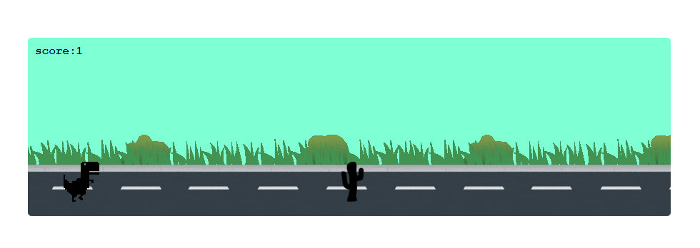
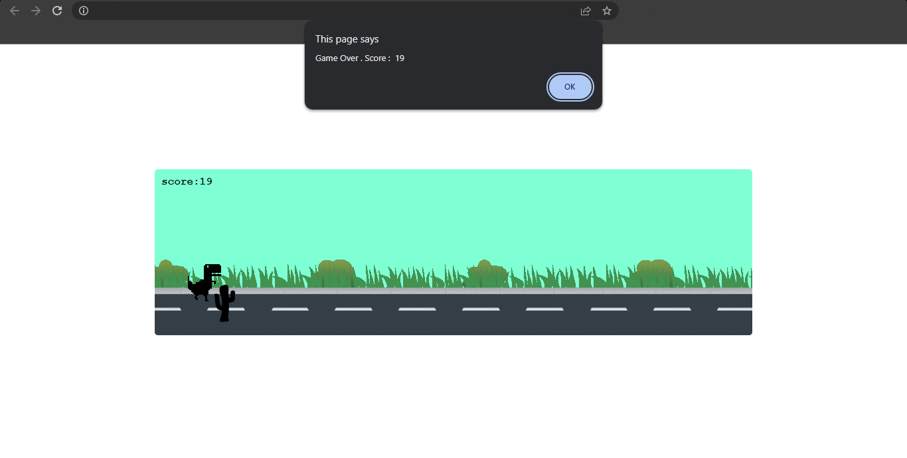

# Trex Game



The Trex Game is a simple web-based game where the player controls a running Trex character, avoiding obstacles and scoring points. It is built using HTML, CSS, and JavaScript.

## Table of Contents

- [Installation](#installation)
- [Usage](#usage)
- [Contributing](#contributing)
- [License](#license)

## Installation

To play the Trex Game locally, follow these steps:

1. Clone the repository:

   ```bash
   git clone https://github.com/sadeq-yaqobi/Trex-game.git
2. Navigate to the project directory:

    ```bash
    cd Trex-game
3. Open the index.html file in a web browser.


## Usage
Once you have the game running in your web browser, use the following controls:

- Press the **spaceKey** or the **left click** to make the Trex character jump.
- Avoid obstacles by jumping over them.
- Your score will increase as you successfully avoid obstacles.
- The game ends if the Trex character collides with an obstacle.




## Contributing
Contributions to the Trex Game project are welcome. If you would like to contribute, please follow these steps:

1. Fork the repository.
2. Create a new branch: `git checkout -b my-new-feature`.
3. Make your changes and commit them: `git commit -m 'Add some feature'`.
4. Push to the branch: `git push origin my-new-feature`.
5. Open a pull request.

Please ensure that your pull request follows the project's coding conventions and includes relevant documentation or tests.

## License
This project is licensed under the [MIT License](https://opensource.org/licenses/MIT).